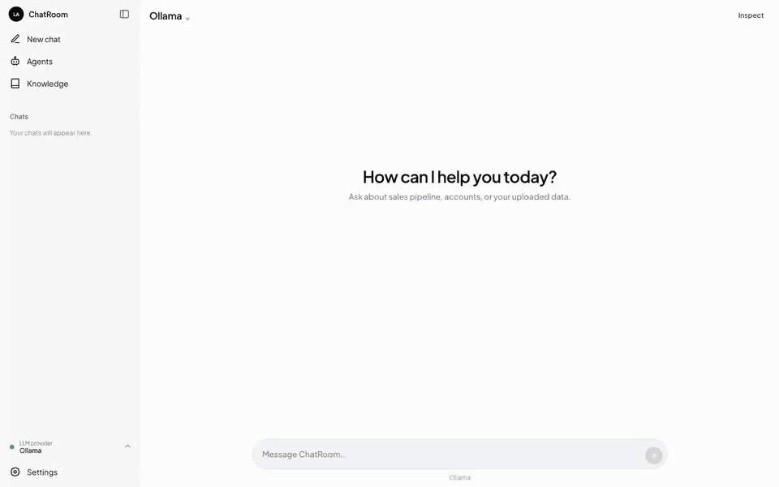
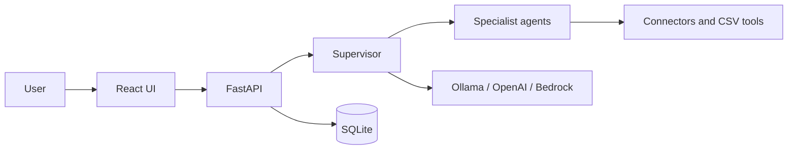

# ChatRoom

ChatRoom is a local-first multi-agent chat platform. A supervisor selects specialized agents, agents use approved tools, and the supervisor combines their findings into one inspectable response.

The project uses React, TypeScript, FastAPI, Python, and SQLite, with provider adapters for Ollama, OpenAI, and Amazon Bedrock.

## Portfolio Demo

[](docs/demo/chatroom-e2e.mp4)

**[Watch the full 1:41 end-to-end demo](docs/demo/chatroom-e2e.mp4)** — review pre-configured Snowflake and external API tools, upload a CSV knowledge base, build specialist agents, analyze Closed Won revenue, inspect orchestration and chart evidence, let the supervisor route a student-grades question automatically, reopen persisted conversations, and review configurable LLM providers.

The walkthrough distinguishes pre-configured tools enabled through backend configuration from dynamically generated tools created by CSV upload. It highlights React and FastAPI integration, multi-agent orchestration, constrained tool access, dynamic CSV ingestion, external-service connectors, evidence-backed observability, chart artifacts, persistence, and repeatable Playwright automation.

## Features

- Supervisor-driven agent routing with deterministic fallback
- Custom agents with constrained tool access
- Snowflake, external API, and uploaded CSV tools
- Persistent conversations, traces, and chart artifacts
- Local mock services for repeatable demos
- 190 passing backend tests

## How It Works



The manager asks the active model to select the smallest useful specialist team. Specialists run in stable order, tool outputs are validated, and the manager synthesizes the final answer. Inspect shows routing decisions, tool calls, findings, and artifacts.

## Quick Start

Requirements: Python 3.11+, `uv`, Node.js 20.19+ or 22.12+, npm, and a configured model provider.

```sh
cp .env.example .env
```

The default configuration uses Ollama with `llama3.2`. Pull and start that model, or configure OpenAI or Bedrock in `.env`.

Start the backend:

```sh
cd backend
uv run uvicorn app.main:app --reload --host 127.0.0.1 --port 8001
```

Start the frontend in another terminal:

```sh
cd frontend
npm ci
npm run dev -- --host 127.0.0.1 --port 5173
```

Open [http://127.0.0.1:5173](http://127.0.0.1:5173).

## Try the Agent Workflows

- Start the bundled connectors with `./mock_services/start_external_api.sh` and `./mock_services/start_snowflake_mock.sh`. See [mock services](mock_services/README.md) for `.env` values.
- Upload `mock_services/data/student_grades.csv` from Settings → Create knowledge base, then assign its generated tool to a custom agent.
- Ask about account `AC-1001`, Closed Won revenue by region, or the uploaded student data.
- Open Inspect to review the agent and tool trace.

All bundled records are synthetic.

## Re-recording the Demo

To record the flow again while the frontend, backend, and bundled connector mocks are running:

```sh
cd frontend
npx playwright install chromium
npm run record:e2e
```

The recorder writes `docs/demo/chatroom-e2e.webm`. Point `SQLITE_DB_PATH` at a temporary file before starting the backend when you want a clean capture without changing existing local conversations.

## Configuration

| Provider | Required setting |
| --- | --- |
| Ollama | `OLLAMA_MODEL` |
| OpenAI | `OPENAI_API_KEY` |
| Bedrock | `BEDROCK_MODEL_ID` and AWS credentials |

Optional connectors use `SNOWFLAKE_*` and `EXTERNAL_API_*` settings. Set `TURN_REPORTS_ENABLED=1` to write local HTML and JSON turn reports under `backend/data/turn_reports/`.

## Verify

```sh
cd backend
uv run pytest
```

```sh
cd frontend
npm run lint
npm run build
```

## Documentation

- [High-level design](docs/high_level_design.md)
- [Low-level design](docs/low_level_design.md)
- FastAPI Swagger UI: `http://127.0.0.1:8001/docs`

## Current Boundaries

- This is a localhost-oriented project without authentication; do not expose it directly to the public internet.
- Chat responses are replayed as buffered chunks after orchestration completes, not streamed token-by-token from the provider.
- Dataset tools currently use inferred arguments; connector tools use model-generated tool calls.
- Successful-turn records are committed sequentially rather than in one atomic transaction.
