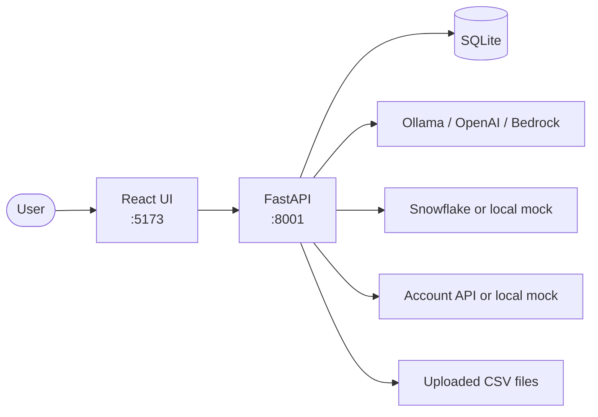
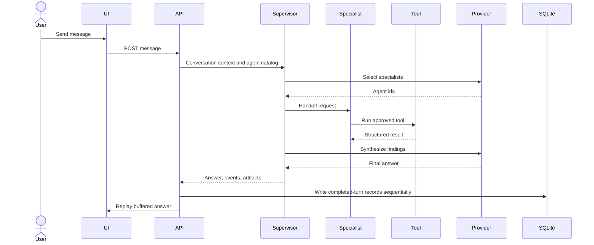

# High-Level Design

ChatRoom is a local-first multi-agent chat application built with React, FastAPI, and SQLite. It separates model providers, agents, and tools so each can evolve independently.

## System Context

## Components

| Component | Responsibility |
| --- | --- |
| React UI | Conversations, provider selection, Settings, and Inspect |
| API routers | HTTP validation and response models |
| `ChatTurnService` | Coordinates provider execution and persistence |
| `ProviderSupervisor` | Selects specialists, runs follow-ups, and synthesizes answers |
| Agent registry | Combines supervisor, connector, and custom agents |
| Tool registry | Combines built-in, connector, and dataset tools |
| Provider adapters | Normalize Ollama, OpenAI, and Bedrock calls |
| Storage | SQLite schema and CRUD for local state |

## Agent Model

- The **supervisor** manages every chat turn.
- **Connector agents** appear when their backend configuration is available.
- **Custom agents** contain instructions and an allowlist of tools.
- **Tools** are local capabilities with parameter schemas and validated runners.

Snowflake and account lookup are tools used by built-in connector agents. Uploaded CSV files become `query_dataset_*` tools that can be assigned to custom agents.

## Chat Turn

Invalid model routing output falls back to deterministic keyword routing. Provider execution finishes before conversation writes begin, so provider failures do not append messages. Successful-turn records use separate commits and are not atomic as a group.

## Persistence

SQLite stores:

- conversations and messages;
- group-chat trace events;
- chart artifacts;
- custom agents; and
- imported dataset metadata.

Uploaded CSV bytes and optional turn reports live under `backend/data/` and are excluded from Git.

## Trust Boundaries

- The app is designed for localhost and has no authentication.
- CORS permits the local Vite development origins.
- CSV uploads are limited to 2 MB.
- Snowflake accepts validated read-only `SELECT` statements, but production use still requires a least-privilege database role.
- Provider credentials and connector secrets are loaded from `.env` and are never stored in SQLite.
- The active provider override is process-global.

See the [Low-Level Design](./low_level_design.md) for endpoints, tables, and module contracts.
