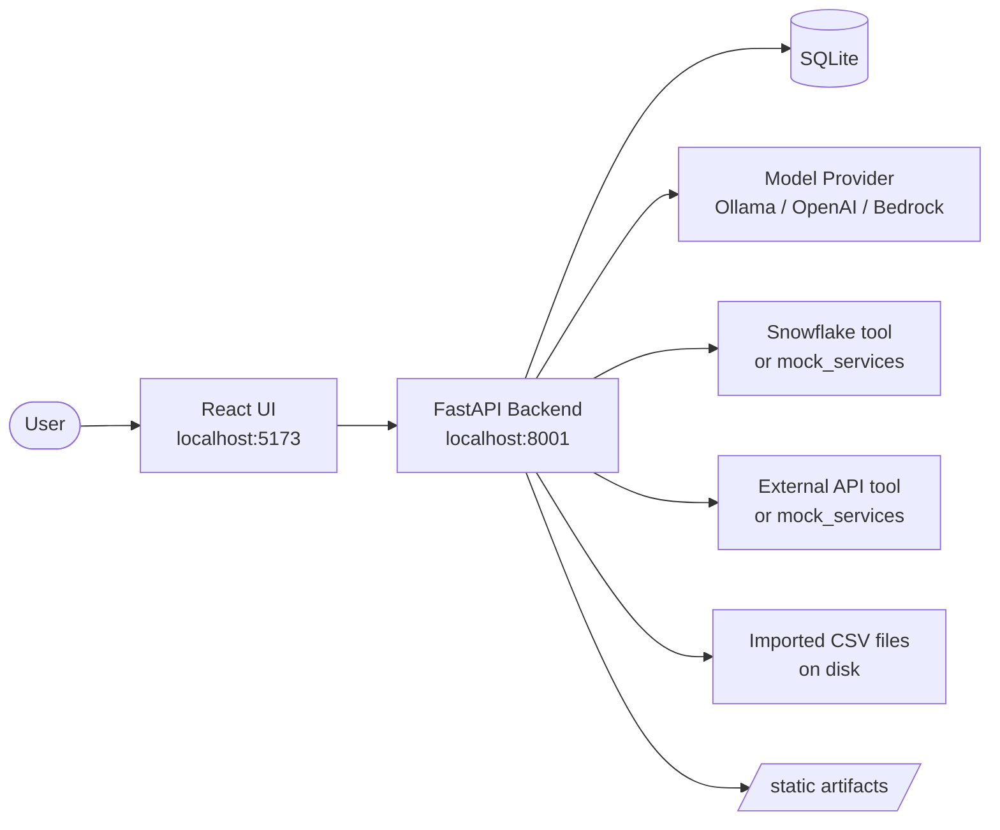
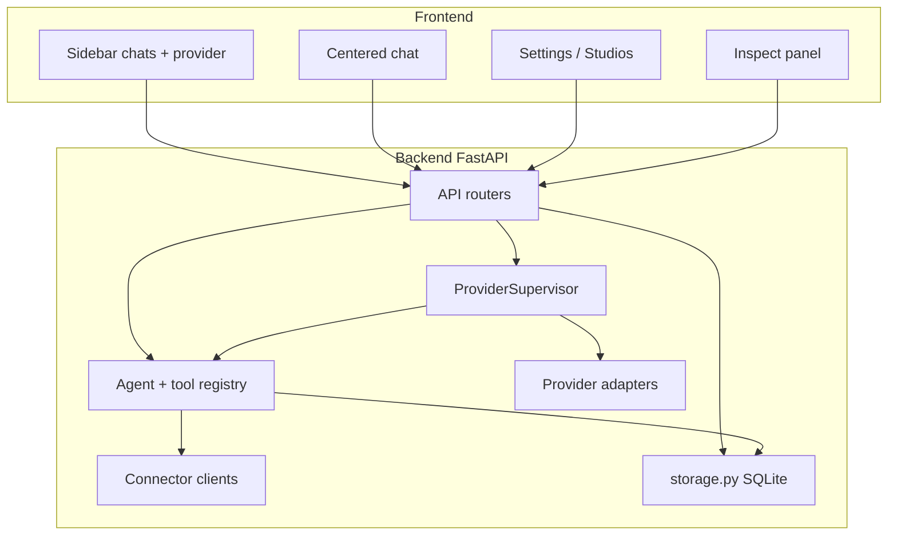

# High-Level Design (HLD)

ChatRoom is a teaching app for multi-agent chat on a small local stack: FastAPI + SQLite + React, with optional Ollama / OpenAI / Bedrock providers and connector tools.

Use this document before E2E testing to understand **what the system is**, **what pieces exist**, and **how a chat turn flows**. For tables, endpoints, and module contracts, see [Low-Level Design](./low_level_design.md). For a single-turn sequence diagram, see [Local Group Chat Flow](./local_group_chat_flow.md).

---

## 1. Goals

| Goal | How this app shows it |
| --- | --- |
| Multi-agent chat | Implicit `supervisor` + specialists (connector agents + optional custom agents) |
| Supervisor model | Manager picks specialists; specialists use tools; one synthesized answer |
| Swappable models | `ModelProvider` factory (`ollama`, `openai`, `bedrock`) |
| Local persistence | SQLite conversations, messages, inspect events, artifacts, custom agents, datasets |
| Tool vs agent clarity | Snowflake SQL / account lookup are **tools**; custom agents **call** tools |

Non-goals: authentication, Postgres, agent bake/publish workflows, MCP, Slack/Zoom, and full per-specialist model tool-call loops.

---

## 2. System context

**Runtime defaults**

- Backend: `127.0.0.1:8001`
- Frontend: `127.0.0.1:5173` (`VITE_API_URL` → backend)
- DB: `SQLITE_DB_PATH` (default under `backend/data/`)
- Active chat provider: `MODEL_PROVIDER` env, overridable at runtime via `PUT /providers/active`

---

## 3. Architecture overview

### Major components

| Component | Responsibility |
| --- | --- |
| **React UI** (`frontend/src/App.tsx`) | ChatGPT-style shell; Settings → Create agent / Knowledge Base; Inspect for trace/artifacts/tools |
| **API layer** (`backend/app/api/`) | Thin HTTP boundary over storage, registries, supervisor |
| **Agent registry** | Merges supervisor + connector agents + custom agents from SQLite |
| **Tool registry** | Static tools + optional connectors + per-dataset `query_dataset_*` tools |
| **ProviderSupervisor** | Asks the model for specialist ids; runs specialist tools; synthesizes answer; emits transcript events |
| **Providers** | Shared `generate()` / `stream()` interface; chat routing uses `generate()` today |
| **Storage** | Schema + CRUD for conversations, messages, events, artifacts, agents, datasets |
| **mock_services/** | Optional local stand-ins for Snowflake + account directory |

---

## 4. Core domain concepts

### Agents vs tools

| Concept | Local meaning | Examples |
| --- | --- | --- |
| **Agent** | Named specialist with instructions and an allowed tool set | Custom agent “Q4 Analyst”; built-in Sales pipeline / Account directory |
| **Tool** | Callable capability with schema + local runner | `query_snowflake`, `lookup_account`, `query_dataset_*`, `summarize_findings` |
| **Supervisor** | Always-present manager that chooses specialists and may run follow-up tools | `supervisor` |
| **Conversation** | Thread with `selected_agent_ids` (always includes supervisor + configured connectors + custom specialists) | Sidebar chat |

Built-in connector agents exist so chat can use Snowflake / External API without creating a custom agent. You can also create a custom agent that attaches those same tools, with or without CSV knowledge tools.

### Studios (UI)

| Studio | Purpose |
| --- | --- |
| **Create agent** → Agent Studio | Name + instructions + **Available options** (connector tools, CSV tools, jump to Knowledge Base) |
| **Create knowledge base** → Knowledge Base Studio | Upload CSV → becomes a `query_dataset_*` tool agents can attach |

---

## 5. End-to-end process flows

### 5.1 Chat turn (happy path)

The backend runs the supervisor before changing conversation history. After a successful supervisor run, it writes the user and assistant messages, events, and artifacts in sequence before replaying the completed answer as buffered text. Provider failures therefore occur before conversation writes. These successful-turn writes currently use separate commits rather than one atomic database transaction. See [local_group_chat_flow.md](./local_group_chat_flow.md) for the detailed sequence and supervisor internals.

### 5.2 Create custom agent

1. Settings → **Create agent**.
2. Fill name + instructions; select tools from Available options (CSV tools required for a visible custom agent; connectors are tools that may also be attached).
3. `POST /custom-agents` → row in `custom_agents`.
4. New chats include that agent id in `selected_agent_ids` (after normalization with supervisor + connectors).

### 5.3 Upload knowledge (CSV)

1. Settings → **Create knowledge base**.
2. `POST /datasets` (multipart) → CSV stored under imported datasets dir + `imported_datasets` row.
3. Tool registry exposes `tool_name` (e.g. `query_dataset_<uuid>`).
4. Agent Studio lists it under Available options for assignment.

### 5.4 Switch model provider

1. Sidebar select → `PUT /providers/active`.
2. In-process override updates `effective_settings()` for subsequent supervisor runs.
3. `GET /health` / `GET /providers/health` reflect readiness.

---

## 6. Data at a glance

Persisted in SQLite (see LLD for columns and constraints):

| Area | Tables |
| --- | --- |
| Chat | `conversations`, `messages` |
| Inspect | `group_chat_events`, `artifacts` |
| Agent Studio | `custom_agents` |
| Knowledge | `imported_datasets` (+ CSV files on disk) |

A legacy `tool_traces` table may still exist in older SQLite files; the active API and Inspect UI use `group_chat_events` instead.

Not in SQLite: active provider override (process memory), model credentials (env), connector config (env).

---

## 7. Trust boundaries and limits

- No auth. Localhost-oriented CORS only.
- CSV import capped at 2 MB.
- Custom specialists run configured tools; connector tools use model tool-calls, while dataset tools still use inferred `{limit: 50}` defaults.
- Stream body is `text/plain` chunks of the **already-completed** supervisor answer (`X-Stream-Mode: buffered`); inspect events are persisted with the completed turn before buffered replay.
- Successful-turn records are written sequentially with separate commits; a later persistence failure can leave an incomplete turn.
- Turn reports are opt-in via `TURN_REPORTS_ENABLED=1` and redact secret-like fields.
- `model_provider` column may still exist on `custom_agents` for older DBs; API no longer uses per-agent providers (global header/provider only).

---

## 8. Related docs

| Doc | Use when |
| --- | --- |
| [low_level_design.md](./low_level_design.md) | Schema, API catalog, modules, invariants |
| [local_group_chat_flow.md](./local_group_chat_flow.md) | One chat-turn Mermaid detail |
| Root [README.md](../README.md) | Runbook and first chat |
