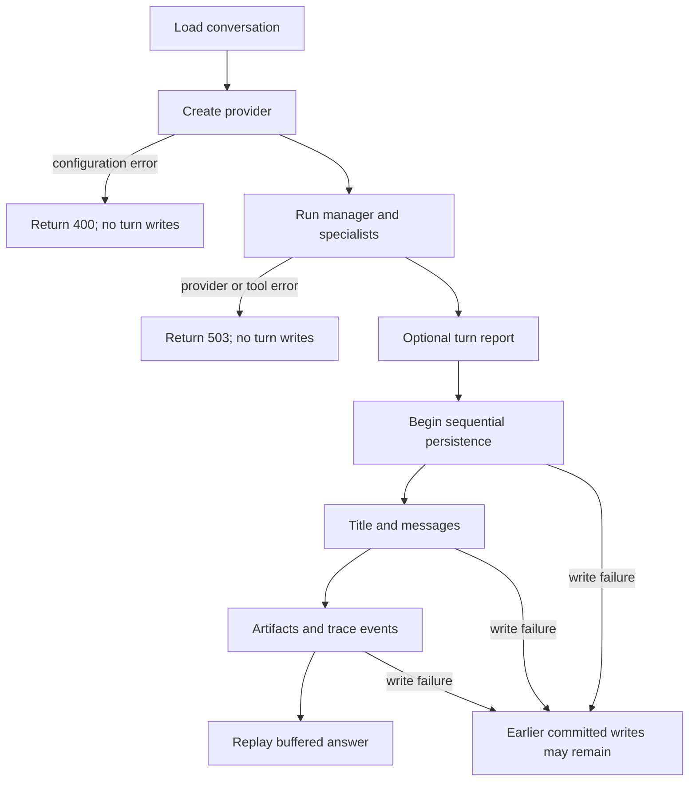

# Local Group Chat Flow

This document follows one ChatRoom message from the React composer through supervisor routing, specialist tools, persistence, and the buffered HTTP response. For the system boundary and component map, see the [High-Level Design](./high_level_design.md). For endpoint and schema contracts, see the [Low-Level Design](./low_level_design.md).

## Successful turn

```mermaid
sequenceDiagram
    autonumber
    actor User
    participant UI as React UI
    participant API as FastAPI conversation route
    participant Service as ChatTurnService
    participant Manager as ProviderSupervisor
    participant Model as Model provider
    participant Specialist as Selected specialist(s)
    participant Tool as Local/connector tool
    participant DB as SQLite

    User->>UI: Submit a message
    UI->>API: POST /conversations/{id}/messages/stream
    API->>DB: Load conversation and prior messages
    API->>Service: run_turn(...)
    Service->>Model: Ask manager to select specialist ids
    Model-->>Manager: {"agent_ids": [...]}
    Note over Manager: Invalid or empty routing output falls back to local keyword routing

    loop Each selected specialist
        Manager->>Specialist: Handoff user request and context
        opt Specialist has a relevant tool
            Specialist->>Model: Request structured tool arguments
            Model-->>Specialist: Tool call arguments
            Specialist->>Tool: Validate and run
            Tool-->>Specialist: Structured result
        end
        Specialist-->>Manager: Finding and tool output
    end

    opt Summary or chart follow-up is requested
        Manager->>Tool: summarize_findings / build_chart_spec
        Tool-->>Manager: Summary or chart specification
    end

    Manager->>Model: Synthesize final answer from findings
    Model-->>Manager: Final answer
    Manager-->>Service: Answer, trace events, artifacts

    Service->>DB: Write optional title
    Service->>DB: Write user message
    Service->>DB: Write assistant message
    Service->>DB: Write artifacts
    Service->>DB: Write group-chat events
    Note over Service,DB: Writes are sequential and commit independently; they are not one atomic transaction

    Service-->>API: Completed turn
    API-->>UI: Buffered text/plain chunks
    Note over API,UI: X-Stream-Mode: buffered; chunks replay an already-completed answer
    UI-->>User: Render answer and refreshed Inspect data
```

## Routing and specialist behavior

1. The conversation's normalized team always contains `supervisor`; configured connector agents are added automatically.
2. The manager receives only specialists allowed for that conversation and asks the active provider for the smallest useful set.
3. Provider output is validated against the catalog. Invalid or empty output activates deterministic keyword routing.
4. Specialists run in stable order. Connector agents use provider-generated tool arguments. Dataset tools currently use inferred defaults such as `{ "limit": 50 }`.
5. The supervisor may run summary or chart follow-ups and then asks the provider to synthesize one answer.
6. `SupervisorResponse.transcript_events` produces the records shown in Inspect: manager start, specialist selection, tool calls and results, specialist answers, and the final answer.

## Failure boundaries



Provider execution completes before conversation history is changed, so provider failures do not create orphan messages. Persistence helpers currently commit independently; once successful-turn persistence begins, a later database failure can leave earlier records in place. This is a documented local-project limitation rather than an atomicity guarantee.

## Inspect output

After the stream completes, `GET /conversations/{id}` returns:

- the user and assistant messages;
- ordered `group_chat_events` for the turn; and
- chart artifacts, if the supervisor created any.

The optional turn report is a separate HTML/JSON diagnostic written only when `TURN_REPORTS_ENABLED=1`.
