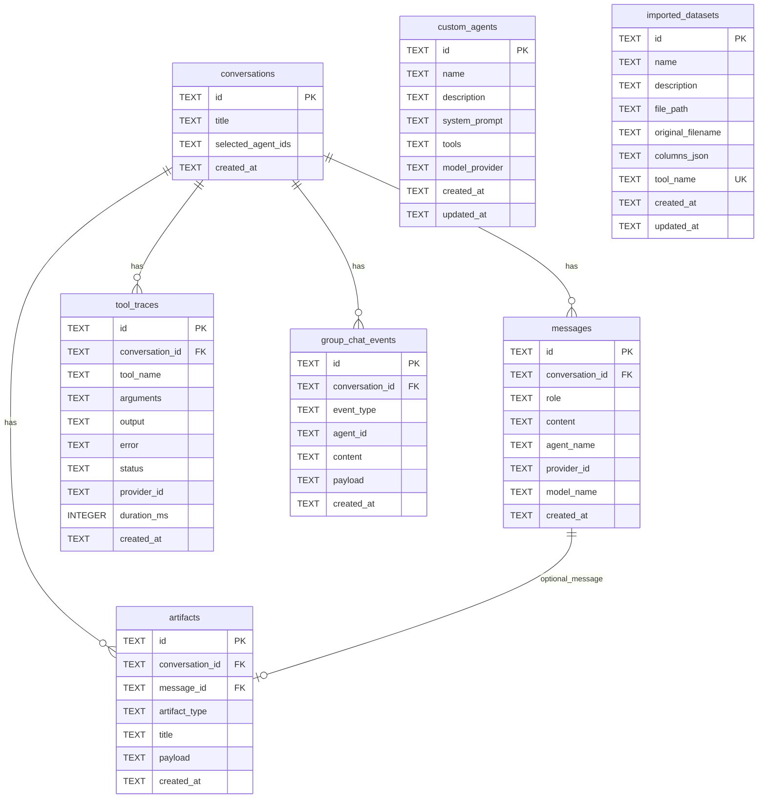

# Low-Level Design (LLD)

Implementation contracts for ChatRoom: database schema, HTTP API, module map, and process-level behavior. Companion to [High-Level Design](./high_level_design.md).

Schema source of truth: `backend/app/storage.py` (`SCHEMA_SQL`). Entrypoint: `backend/app/main.py`.

---

## 1. Repository layout (runtime)

```text
chatroom/
├── backend/
│   ├── app/
│   │   ├── main.py              # FastAPI app + routers + static artifacts
│   │   ├── api/                 # HTTP routes
│   │   ├── models/              # Pydantic request/response models
│   │   ├── providers/           # ollama / openai / bedrock
│   │   ├── connectors/          # snowflake + external_api clients
│   │   ├── storage.py           # SQLite schema + persistence
│   │   ├── database.py          # request-scoped connection dependency
│   │   ├── services/            # chat-turn orchestration + persistence
│   │   ├── agent_registry.py    # merge builtin / connector / custom
│   │   ├── connector_agents.py  # Sales pipeline + Account directory agents
│   │   ├── tool_registry.py     # static + connector + dataset tools
│   │   ├── supervisor/          # ProviderSupervisor package
│   │   ├── routing.py           # keyword fallback routing
│   │   ├── turn_report.py       # optional HTML/JSON turn reports
│   │   └── settings.py          # env + active provider override
│   ├── tools/                   # LocalTool implementations
│   ├── data/                    # sqlite, CSVs, artifacts (local)
│   └── tests/
├── frontend/src/                # App.tsx + gpt-layout.css + index.css
├── mock_services/               # optional connector mocks
└── docs/
```

---

## 2. Database schema

Engine: **SQLite** with `PRAGMA foreign_keys = ON`. Path: `Settings.sqlite_db_path`.

Connections open via `connect_database()` which applies `SCHEMA_SQL` (`CREATE TABLE IF NOT EXISTS`).

### 2.1 ER diagram



`custom_agents` and `imported_datasets` are independent of conversations (referenced by id/tool name at runtime, not FK).

### 2.2 Table details

#### `conversations`

| Column | Type | Notes |
| --- | --- | --- |
| `id` | TEXT PK | UUID-style string |
| `title` | TEXT | Defaulted on create (often from first message / placeholder) |
| `selected_agent_ids` | TEXT | JSON array of agent ids |
| `created_at` | TEXT | `CURRENT_TIMESTAMP` |

**Normalization on write** (`_normalize_selected_agent_ids` in `api/conversations.py`):

1. Always include `supervisor`.
2. Always include configured connector agent ids (`connector_sales_pipeline`, `connector_account_directory`).
3. Append remaining custom specialist ids from the request body.
4. If no specialists at all → `[supervisor]` only.

#### `messages`

| Column | Type | Notes |
| --- | --- | --- |
| `id` | TEXT PK | |
| `conversation_id` | TEXT FK | `ON DELETE CASCADE` |
| `role` | TEXT | `user` \| `assistant` \| `system` \| `tool` |
| `content` | TEXT | |
| `agent_name` | TEXT NULL | e.g. `supervisor` on assistant turns |
| `provider_id` | TEXT NULL | Active provider for that turn |
| `model_name` | TEXT NULL | Provider model id if known |
| `created_at` | TEXT | |

Index: `(conversation_id, created_at)`.

#### `group_chat_events` (Inspect → Trace)

| Column | Type | Notes |
| --- | --- | --- |
| `event_type` | TEXT | See enum below |
| `agent_id` | TEXT NULL | Specialist or supervisor |
| `content` | TEXT | Human-readable summary |
| `payload` | TEXT | JSON object |

Allowed `event_type` values:

- `manager_started`
- `specialist_selected`
- `tool_called`
- `tool_finished`
- `specialist_answered`
- `final_answer`

Built in `models/supervisor.py` from the supervisor run; persisted with the completed turn before buffered response replay.

#### `artifacts` (Inspect → Artifacts)

| Column | Type | Notes |
| --- | --- | --- |
| `artifact_type` | TEXT | Currently only `chart` |
| `title` | TEXT | |
| `payload` | TEXT | JSON chart spec |
| `message_id` | TEXT NULL FK | Assistant message; `ON DELETE SET NULL` |

#### `tool_traces` (legacy)

Structured tool execution log table retained for older local databases. The active chat path does **not** write `tool_traces`; Inspect uses `group_chat_events`. The conversation detail API no longer returns `tool_traces`.

#### `custom_agents`

| Column | Type | Notes |
| --- | --- | --- |
| `id` | TEXT PK | Prefixed `custom_<uuid>` |
| `name`, `description`, `system_prompt` | TEXT | |
| `tools` | TEXT | JSON array of tool name strings |
| `model_provider` | TEXT | Legacy column, default `ollama`; **not used by API** (global provider only) |
| `created_at`, `updated_at` | TEXT | |

#### `imported_datasets`

| Column | Type | Notes |
| --- | --- | --- |
| `id` | TEXT PK | Prefixed `dataset_<uuid>` |
| `file_path` | TEXT | Absolute/local path under `imported_datasets_dir` |
| `columns_json` | TEXT | `[{name, column_type}, ...]` |
| `tool_name` | TEXT UNIQUE | e.g. `query_dataset_<sanitized_id>` |

CSV bytes live on disk; deleting the dataset removes the DB row and file.

---

## 3. HTTP API catalog

Base URL: `http://127.0.0.1:8001` (no `/v1` prefix).
CORS: localhost Vite ports `5173` / `5174`.
Static: `/artifacts` → `artifact_static_dir`.

### 3.1 Health & providers

| Method | Path | Purpose |
| --- | --- | --- |
| `GET` | `/health` | `{ status, model_provider }` active provider |
| `GET` | `/providers` | Same as health listing |
| `GET` | `/providers/health?live=` | Per-provider ready/missing/live check |
| `PUT` | `/providers/active` | Body `{ "provider_id" }` → runtime override |

Supported provider ids: `ollama`, `openai`, `bedrock`.

### 3.2 Agents & tools

| Method | Path | Purpose |
| --- | --- | --- |
| `GET` | `/agents` | Builtin + connector + custom agents; teams; `supervisor_agent_id` |
| `GET` | `/tools` | UI-assignable tools (excludes supervisor-only) |
| `GET` | `/connectors` | Connector health, purpose, hints |

### 3.3 Custom agents

| Method | Path | Purpose |
| --- | --- | --- |
| `GET` | `/custom-agents` | List |
| `POST` | `/custom-agents` | Create `{ name, description, system_prompt, tools }` |
| `GET` | `/custom-agents/{id}` | Detail |
| `PUT` | `/custom-agents/{id}` | Full replace of fields above |
| `DELETE` | `/custom-agents/{id}` | 204 |

Tool names validated against the tool registry (400 on unknown).

### 3.4 Datasets (Knowledge Base)

| Method | Path | Purpose |
| --- | --- | --- |
| `GET` | `/datasets` | `{ datasets: [...] }` |
| `GET` | `/datasets/{id}` | Detail |
| `POST` | `/datasets` | `multipart/form-data`: `name`, `description?`, `file` (.csv, ≤ 2 MB) |
| `DELETE` | `/datasets/{id}` | 204 |

### 3.5 Conversations & chat

| Method | Path | Purpose |
| --- | --- | --- |
| `GET` | `/conversations` | List metadata |
| `POST` | `/conversations` | Create `{ selected_agent_ids? }` → normalized ids |
| `GET` | `/conversations/{id}` | Detail: messages, group_chat_events, artifacts |
| `PATCH` | `/conversations/{id}` | Rename `{ title }` |
| `DELETE` | `/conversations/{id}` | Cascade delete children |
| `POST` | `/conversations/{id}/messages/stream` | Body `{ content }` → buffered `text/plain` (`X-Stream-Mode: buffered`) |

**Stream contract**

1. Run `ProviderSupervisor` to completion without mutating conversation history.
2. Write the title, user message, assistant message, artifacts, and `group_chat_events` sequentially. Storage helpers currently commit each write independently; this is not one atomic transaction.
3. Replay the completed answer in ~24-character chunks (`text/plain`).
4. Return `X-Stream-Mode: buffered` and `X-Request-Id` headers.

---

## 4. Runtime module contracts

### 4.1 Settings (`settings.py`)

| Concern | Mechanism |
| --- | --- |
| Default provider | `MODEL_PROVIDER` |
| Active provider | `_model_provider_override` via `set_active_model_provider` |
| Effective config | `effective_settings()` returns `Settings` with overridden `model_provider` |
| Connectors | `SNOWFLAKE_*`, `EXTERNAL_API_*`, `SNOWFLAKE_MOCK_URL` |

### 4.2 Agent resolution (`agent_registry.py` + `connector_agents.py`)

```text
resolve_agent(id) =
  LOCAL_AGENTS[id]                # supervisor
  OR connector agent if configured
  OR custom_agents row → LocalAgent
```

`LocalAgent` fields: `id`, `name`, `description`, `system_prompt`, `tools` (tuple). No per-agent provider.

Connector agent ids (when env configured):

| Agent id | Name | Tool |
| --- | --- | --- |
| `connector_sales_pipeline` | Sales pipeline | `query_snowflake` |
| `connector_account_directory` | Account directory | `lookup_account` |

### 4.3 Tool resolution (`tool_registry.py`)

```text
list_all_tools =
  static tools
  + query_snowflake if snowflake configured
  + lookup_account if external API configured
  + build_dataset_tool(record) for each imported dataset

SUPERVISOR_ONLY = { summarize_findings, build_chart_spec }
list_ui_tools = list_all_tools − SUPERVISOR_ONLY
```

`tool_connection_scope(connection)` binds the request SQLite connection for dataset tools during a supervisor turn.

### 4.4 ProviderSupervisor (`supervisor/`)

| Step | Behavior |
| --- | --- |
| Manager call | `provider.generate` with catalog descriptions; expect JSON `agent_ids` |
| Validation | Keep ids that exist in request catalog / allowed specialists |
| Fallback | `route_agent_ids(request)` keyword heuristics |
| Specialist run | Connector tools use provider tool-calls; dataset tools still fall back to inferred `{limit: 50}` |
| Follow-ups | If prompt wants summary/chart → `summarize_findings` / `build_chart_spec` |
| Response | Synthesized text + `AgentRunResult`s → transcript events + chart artifacts |

Keyword routing lives in `routing.py` and is **fallback only**. Shared specialist selection lives in `supervisor/team.py`.

### 4.5 Providers (`providers/`)

| Class | Config gate |
| --- | --- |
| `OllamaProvider` | `OLLAMA_MODEL` |
| `OpenAIProvider` | `OPENAI_API_KEY` |
| `BedrockProvider` | `BEDROCK_MODEL_ID` + AWS creds |

Factory: `create_model_provider(settings)`.

---

## 5. Process-level sequences

### 5.1 Message stream (code path)

```text
POST /conversations/{id}/messages/stream
  ├─ get_conversation / 404
  ├─ ChatTurnService.run_turn
  │    ├─ create_model_provider (400 on config error)
  │    ├─ ProviderSupervisor.run  (503 on provider failure; no DB mutation yet)
  │    ├─ optional write_turn_report (opt-in)
  │    └─ persist title + user + assistant + events + artifacts
  └─ StreamingResponse(buffered text chunks, X-Stream-Mode=buffered)
```

Persistence starts only after a successful supervisor run, so failed provider turns leave the conversation unchanged. Once persistence begins, storage helpers commit records separately; a failure during a later write can leave an incomplete turn.

### 5.2 Dataset import

```text
POST /datasets
  ├─ validate name + .csv + size ≤ 2MB
  ├─ write temp file
  ├─ inspect_csv_columns(temp)
  ├─ create_imported_dataset → copy to datasets_dir, INSERT row
  └─ tool appears on next GET /tools
```

### 5.3 Frontend Settings filter (product rule)

UI `isStaleCustomAgent`: custom agents with no usable tools (only supervisor-only leftovers) are hidden. Saving a custom agent requires at least one tool — backend connector (`query_snowflake` / `lookup_account`) and/or a CSV knowledge tool.

---

## 6. Invariants useful for E2E

1. Every persisted conversation’s `selected_agent_ids` starts with `supervisor` after create/update normalization.
2. Configured connector agents are always re-injected into `selected_agent_ids`.
3. Chat provider is **global** (`MODEL_PROVIDER` / `/providers/active`), not per custom agent.
4. Supervisor-only tools never appear in Agent Studio assignment lists.
5. Streaming does not yield tokens from the model incrementally for the supervisor turn today—it chunk-replays the finished answer.
6. Inspect data (`group_chat_events`, `artifacts`) is visible after reload of conversation detail once the stream ends.
7. Deleting a conversation cascades messages, events, artifacts, and tool_traces.
8. Deleting a dataset removes its query tool from the registry and cannot leave a dangling UNIQUE `tool_name`.
9. Successful-turn persistence is sequential, not atomic; tests and operational expectations should not assume rollback of earlier writes after a later persistence failure.

---

## 7. E2E testing

Prefer the detailed walkthrough: [e2e_test_scenarios.md](./e2e_test_scenarios.md).

---

## 8. OpenAPI

With the backend running:

- Swagger UI: `http://127.0.0.1:8001/docs`
- ReDoc: `http://127.0.0.1:8001/redoc`
